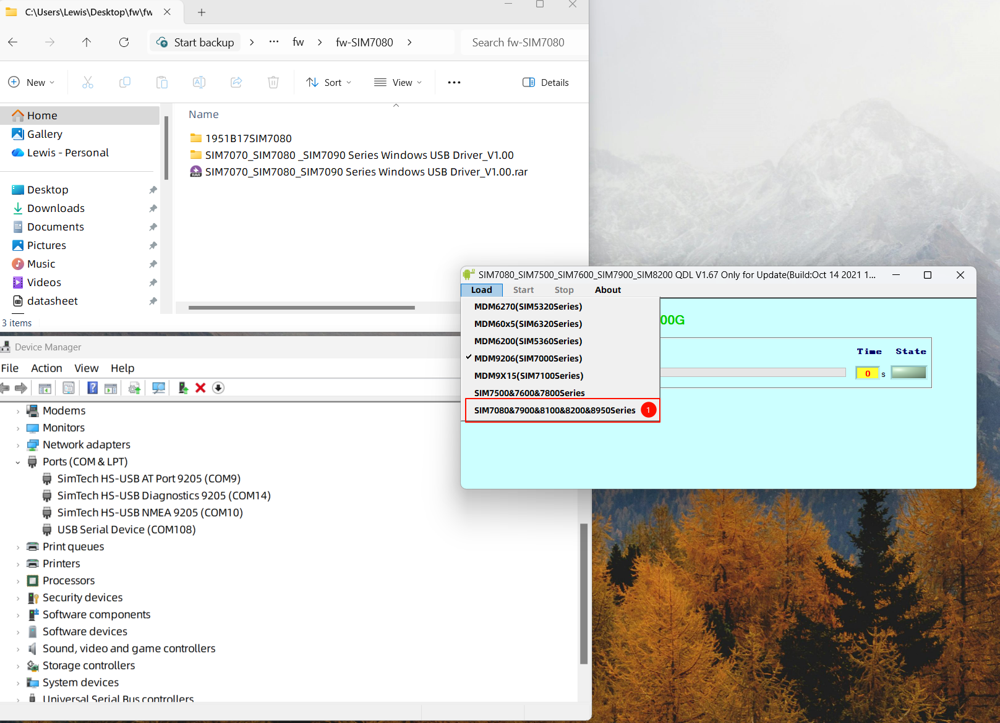
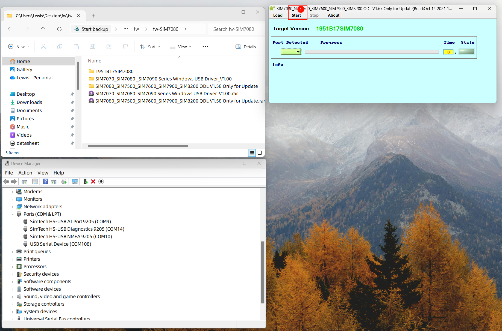
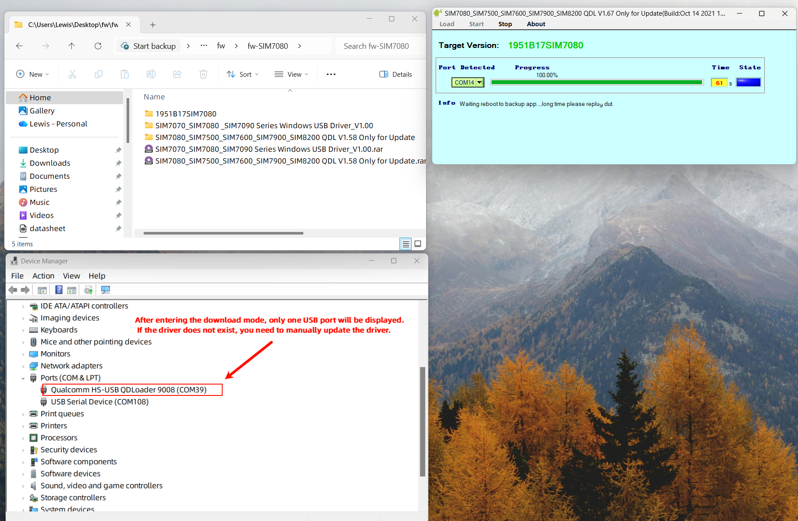
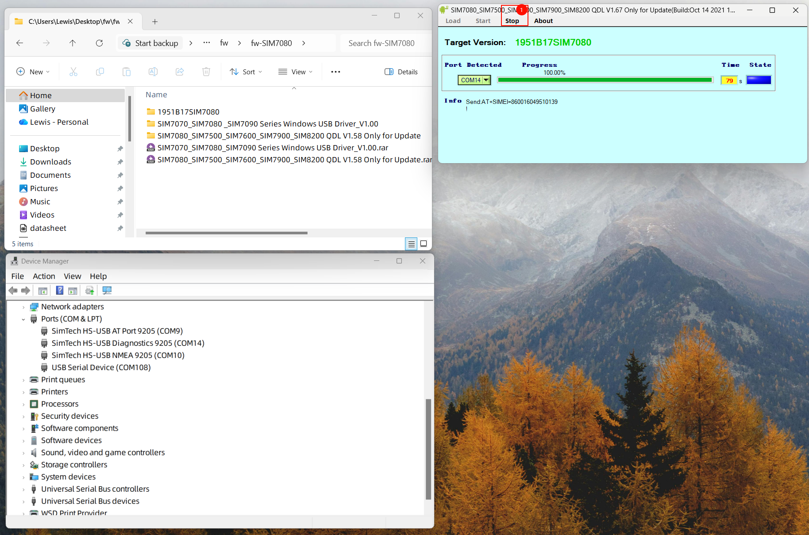

  

<h1 align = "center">🌟LilyGo SIM7080 Upgrade Guide🌟</h1>

## Resources

- [SIM7080G_FlashTools v1.6.7](https://drive.google.com/file/d/1nOqJuzBgE8KrMkpQUAWy3nJwqEBVABVn/view?usp=sharing)
- [SIM7080G_Driver](https://drive.google.com/file/d/1-yT3QcNJQEoD4ZkTbAu4SbsyxcA5Wxn6/view?usp=sharing)
- [Firmware 1951B17SIM7080](https://drive.google.com/file/d/1-m0eF53mw9n0vw4vfNZ88cRR3GM0T-a1/view?usp=sharing)

## `1` Write to ATDebug

* Write [ATDebug](../../../examples/ATdebug/ATdebug.ino) to start the modem without running any application

## `2` Connect to the Modem USB port

- The SIM7080G-S3-Standard version requires two USB-C ports.
- Connect both the ESP32 USB-C port and the modem's USB port to your computer, using one port for power and the other for modem upgrades.

## `3` Update Driver

## `4` Update the firmware

1. Click **Load -> SIM7080&7900&8100&8200&8950Series**

2. Click **... -> Select the firmware folder (the downloaded firmware is compressed in rar or zip format and needs to be unzipped first)**

3. Close Firmware Selection -> Click **Start**

4. Wait for the upgrade to complete

5. After the upgrade is complete, the modem's USB port will appear in the device manager again. Click **stop**

6. Open the serial monitor, restart ESP32, and send `AT+SIMCOMATI` to query the current running firmware version.

7. The upgrade is now complete