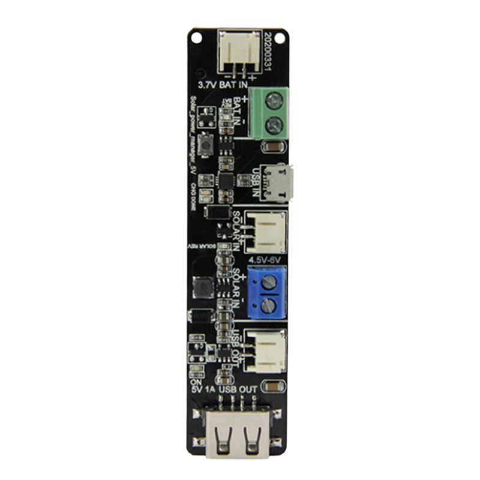

  

<h1 align = "center">🌟LilyGo T-BAT Usage Guide🌟</h1>

  

### ⚡ Electrical parameters

| Features                               | Details  |
| -------------------------------------- | -------- |
| USB input voltage                      | 4.5~5.5V |
| Solar Input Voltage                    | 4.5 ~ 6V |
| Battery interface allows input voltage | 4.2V     |
| MicroUSB/Solar Charge Max Current      | 500mA    |
| USB OUT                                | 1A       |

### ⚡Battery Protector Description

| Features                | Details    |
| ----------------------- | ---------- |
| Over-Voltage Threshold  | 4.30V      |
| Under-Voltage Threshold | 2.4V       |
| Over-Discharge Current  | 3A         |
| ChipName                | [DW06D][2] |

### Button Description

* Upon first power-on or when battery protection is triggered, pressing the button will restore battery output function.

### LED Description

| FUNCTION            | COLOR  | STATE                                                                                              |
| ------------------- | ------ | -------------------------------------------------------------------------------------------------- |
| Solar  indicator    | Yellow | The light stays on when the input is reversed, and turns off when the input is connected normally. |
| Battery indicator   | Yellow | The light stays on when the input is reversed, and turns off when the input is connected normally. |
| 5V Output indicator | Green  | The 5V output light is always on and turns off when switched off.                                  |
| Charge indicator    | Green  | Changliang is full of light ,Turn off while charging                                               |
| Charge indicator    | Red    | The light turns on when charging and turns off when fully charged.                                 |

## Schematic

[T-BAT-Rev1.0 schematic](../../../../schematic/shield/T-BAT-Rev1.0.pdf)

[2]: https://item.szlcsc.com/datasheet/DW06D%252FJ/83278.html?spm=sc.it.pdf.fd___sc.gbn.xh1.zy.n&lcsc_vid=QgRWVldWE1dZAwECQFUMVgYHFFRdXlxWRlELVFQFTgMxVlNTT1hdUldfQ1JeXjsOAxUeFF5JWBYZEEoEHg8JSQcJGk4%3D
