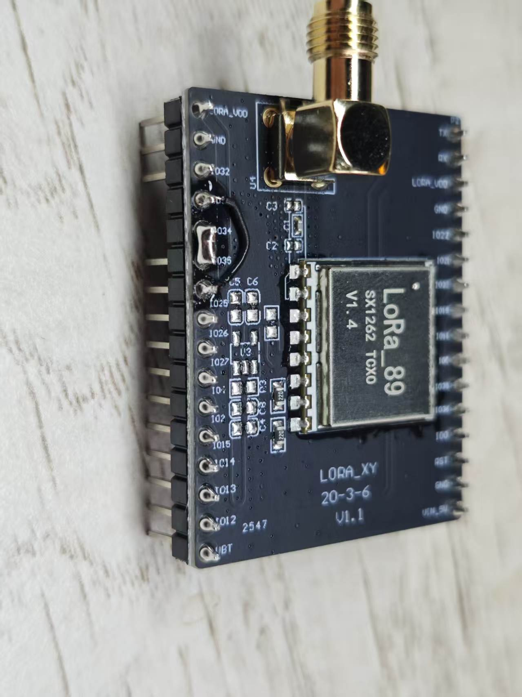
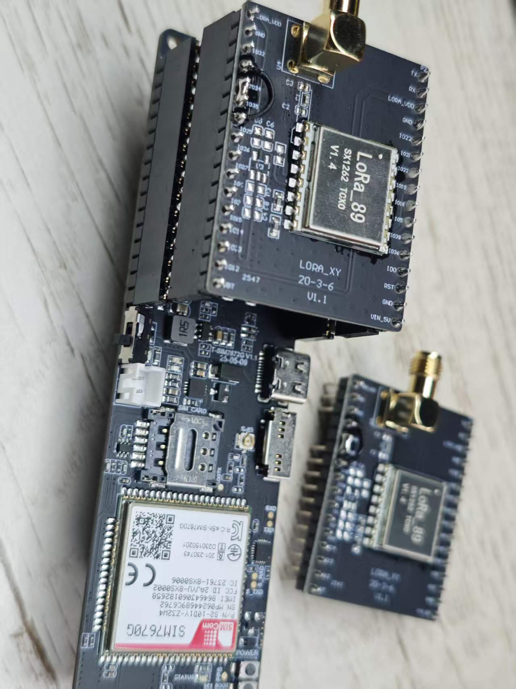

# SIM7670G_LoraShield

### [LoRa Shield](https://lilygo.cc/products/ttgo-accessories-shield-lora-868-915-mhz) was originally designed for use with the SIM7000G motherboard, but it can also be used with the SIM7670G motherboard through simple jumper settings.

### Pins

| Shield Silkscreen | Function | SIM7670G GPIO |
| ----------------- | -------- | ------------- |
| (Silkscreen IO33) | BUSY     | 6             |
| (Silkscreen IO34) | IRQ      | 7             |
| (Silkscreen IO23) | MOSI     | 42            |
| (Silkscreen IO19) | MISO     | 41            |
| (Silkscreen IO18) | SCLK     | 40            |
| (Silkscreen IO12) | RST      | 21            |
| (Silkscreen IO5 ) | CS       | 39            |

### Illustration

